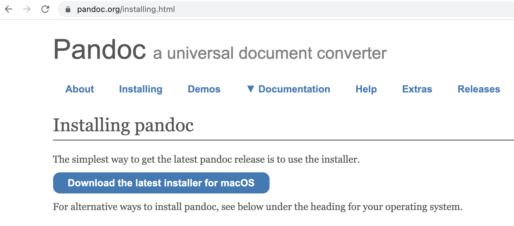
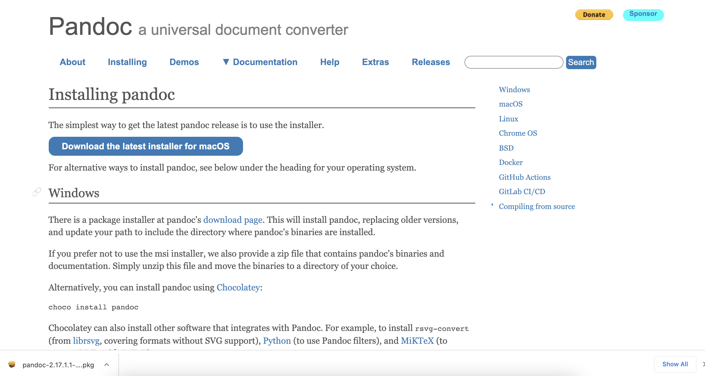
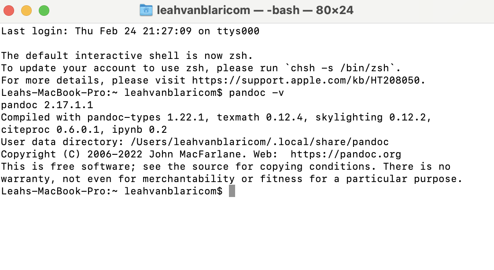

# How to Download and Install Pandoc 
This guide will teach you how to download and install Pandoc.

## Tools 
- Computer 
- Finder 
- Internet
- Terminal

## Directions 
1. Navigate to [Pandoc](https://pandoc.org/installing.html). 
    <figure>  
      <figcaption> Image of Pandoc installation page. </figcaption> </figure>
2.  Click on the "Download the latest installer for macOS" blue button. The Pandoc installer will appear at the bottom of your screen. 
    <figure>  
     <figcaption> Image of installer at the bottom of the screen. </figcaption> </figure>
3. Click the package icon to open the installer. The installer will open in a new window on your computer.
   <figure>  
   <figcaption> Image of installation window. </figure>
4. Read the introduction to the Pandoc installer on your screen.
5. Click continue to navigate through the installer. Agree to the terms and conditions. 
6. Click Install. Input your password. 
7. Close the window. Move the Pandoc installer to the trash when prompted. 
8.  Open your Terminal application. 
9.  Type "pandoc -v" in the Terminal. Press Enter. Information about Pandoc will appear. The installation is now complete. 
     <figure>  
     <figcaption> Image of the Terminal after using "pandoc -v" command. </figure>

Back to [the home page](../index.html)