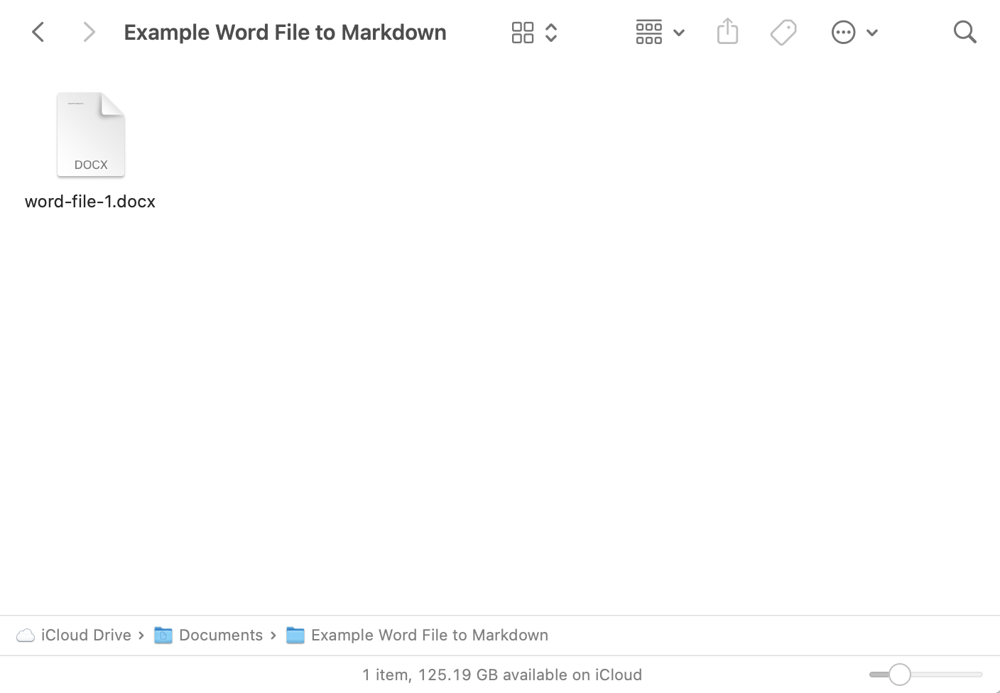
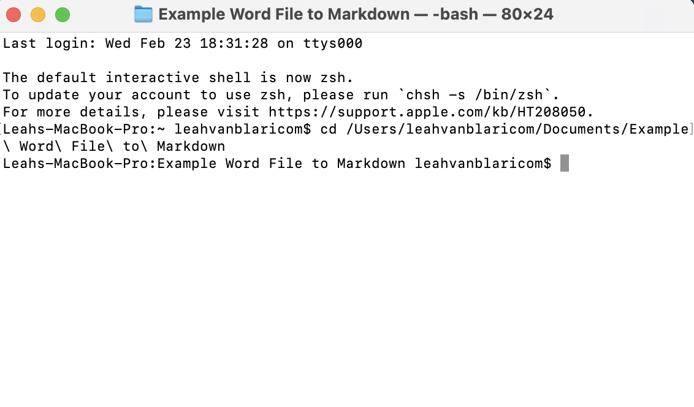
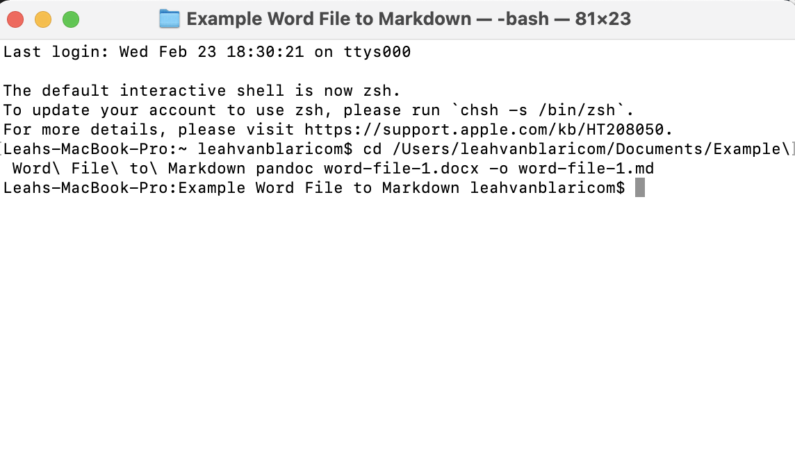
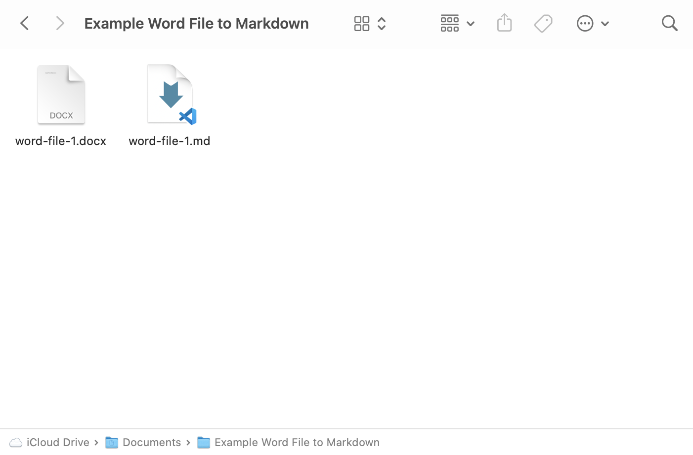

# Converting Word to Markdown

This guide will allow you to change Word documents to Markdown files using Pandoc. 
## Tools 
- Pandoc 
- Terminal
- Finder
- Word document file 

## Directions 
1. Save your Word document file in a document folder on your computer. Your document must have at least one sentence of text.
   -  `NOTE:` Your Word doc file cannot have any spaces. An example could be "word-file-1.docx"
2. Using the Finder application, locate your document folder. 
   <figure>  </img>
    <figcaption> Image of file in file folder. </figcaption> </figure>

3. Select 'View' on Finder's control panel, then click 'Show Path Bar.' This will reveal a path bar at the bottom of the Finder screen. 
   <figure>  </img>
   <figcaption> Image of Path Bar at the bottom of the Finder application. </figcaption> </figure>
4. Open the Terminal app. 
5. Type "cd " into the Terminal, then drag your folder from the Path Bar into the terminal.
   - `NOTE:` "cd " **must have a space after it** and must be lowercase or the command will not work. 
6. Click enter. Terminal is now "inside" that folder in your computer. 
   <figure>  </img>
    <figcaption> Image of the Terminal after the command "cd" is inputted. </figcaption> </figure>
7. Type "pandoc (your file name).md -o (your file name).docx.
   - `NOTE:` An example using the file example above would be: "pandoc word-file-1.docx -o word-file-1.md"
    <figure>  </img>
    <figcaption> Image of the Terminal after the Pandoc command is inputted. </figcaption> </figure>

8. Click enter. Your Markdown file will appear within your orgininal document folder. 
   <figure> 
    <figcaption> Image of the Markdown file created using the Pandoc code. </figcaption> </figure>

Back to [the home page](../index.html)
